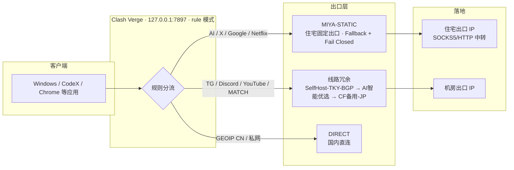

# codex-network-resilience

> 一套「CodeX 网络故障排查 → Clash Verge 分流配置 → 住宅代理固定出口」的实践方法论与可复用配置。
> 来源：本人在 Windows + Clash Verge (Mihomo) + 机场订阅 + MIYAIP 静态住宅 IP 环境下的真实排障与加固记录。

## 为什么需要这套方案

使用 CodeX / ChatGPT / GPT 等 AI 服务时，网络问题通常不是"没网"，而是**出口 IP 信誉、代理链路配置错误、本地中转被第三方工具劫持**等原因。本项目沉淀一套可复用的排查与配置框架，帮助你：

- 定位并修复 CodeX 走错代理/被本地中转劫持的问题
- 让 AI / GPT / 账号类服务走**固定住宅出口**（避开机房 IP 封锁）
- 让 TG / Discord / YouTube / MATCH 走**线路冗余**（自建 VPS → 机场 → CF）
- 用 **Fail Closed** 保证固定出口失效时绝不静默泄露为机房 IP

## 目录结构

```
codex-network-resilience/
├── README.md
├── docs/
│   ├── 01-codex-network-troubleshooting.md   # CodeX 网络故障排查手册
│   ├── 02-clash-verge-configuration.md        # Clash Verge 分流配置策略
│   ├── 03-residential-proxy-strategy.md       # 住宅代理固定出口策略
│   ├── 04-methodology-references.md           # 借鉴的项目与方法论
│   ├── 05-backup-client-nekobox.md            # 备用客户端 NekoBox（客户端级冗余）
│   ├── 06-selfhost-vps-roadmap.md             # 自建 VPS 路线图（彻底摆脱机场依赖）
│   ├── 07-vps-provider-research.md            # 低价 VPS 厂商调研（DediRock 案例 + 库存 API 逆向）
│   ├── 08-clients-and-fallback-playbook.md    # 客户端矩阵与应急策略（bannedbook/fanqiang 整理）
│   ├── 09-censorship-theory-and-coldstart.md  # 封锁原理速查与冷启动预案（fq-book 整合）
│   └── 10-codex-handoff.md                    # 交接 Codex：方案 C+D、已完成与未完成任务
├── scripts/
│   ├── deploy-vps-xray.sh                     # VPS 一键部署 Xray VLESS+REALITY
│   └── filter-best-node.ps1                   # 基于 ip-api.com 的节点质量筛选脚本
```

## 核心结论（TL;DR）

1. **CodeX 连接失败先查三件事**：`.codex/.env` 的代理端口、`config.toml` 的 `openai_base_url`、`auth.json` 的 `auth_mode` 与 API Key。第三方工具（opencodex / teamorouter 等）可能悄悄注入这些值。
2. **Clash 用 rule 模式 + 按域名分流**：AI/X/Google/Netflix → MIYA-STATIC；TG/Discord/YouTube/MATCH → 线路冗余。
3. **固定出口必须 Fail Closed**：住宅组只放住宅节点，住宅失效时请求失败，而不是静默回落到机场机房 IP。
4. **住宅节点做健康检查**：`fallback` 组 + 每 120s 健康检查，SOCKS5 挂了自动切 HTTP，仍保持住宅出口。
5. **永远不要只准备一套线路**：线路冗余固定为自建 VPS → 机场 → CF；住宅单独 Fail Closed，不与机房互相回退。
6. **企业网络先做连通性验证再配置**：防火墙可能是 SNI 域名黑名单（知名代理域名被掐、普通 CF 域名畅通），测速超低延迟可能是 TCP SYN 本地代答的假象——用 TLS 握手 + 端到端出口验证甄别。
7. **客户端也做冗余**：Clash Verge（主，规则分流强）+ NekoBox（备，故障域隔离），两套内核两套配置流水线，一个瘫痪另一个顶上。
8. **去广告在规则层拦截**：`GEOSITE,category-ads-all,REJECT` 一行规则全局去广告，省流量且零维护。
9. **低价 VPS 当可丢弃资源**：年付 < $15 的机器只做探针/备份/练手；买前看厂商年龄、SLA、社区故障史（详见 docs/07），生产业务选成熟商家。
10. **先定性封锁类型再动手**：Ping 通 + TCP 端口超时 = IP 被墙（回程阻断）；证书报错 = DNS 污染——对症下药，别用排除法浪费时间（详见 docs/09）。

## 架构图



**阅读要点**：入口问题换节点；出口问题换策略。AI/X/Google/Netflix 走住宅（纯净、Fail Closed），TG/Discord/YouTube/MATCH 走线路冗余，国内直连。

## 快速开始

```powershell
# 1. 节点质量筛选（基于 ip-api.com，自动重建 AI 优选池）
powershell -NoProfile -ExecutionPolicy Bypass -File scripts/filter-best-node.ps1

# 2. 验证当前出口 IP（应返回住宅 IP 或期望节点 IP）
curl.exe -4 -x http://127.0.0.1:7897 https://api.ipify.org
```

## 安全说明

本仓库**不包含**任何真实凭据：

- 所有账号 / 密码 / token / 订阅链接 / 服务器地址一律使用占位符，如 `<MIYAIP_HOST>`、`<USERNAME>`、`<PASSWORD>`
- 使用本项目前，请将占位符替换为你自己的配置
- 不要把密钥提交到 Git

## License

MIT
