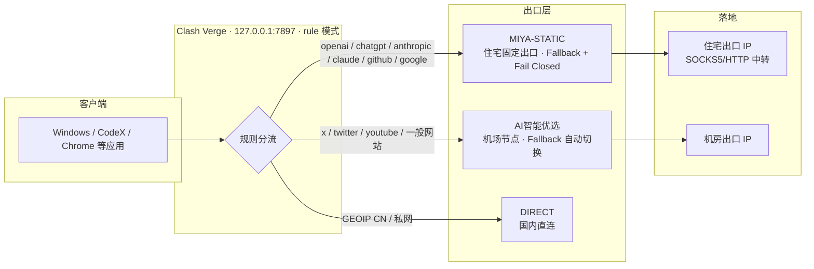

# codex-network-resilience

> 一套「CodeX 网络故障排查 → Clash Verge 分流配置 → 住宅代理固定出口」的实践方法论与可复用配置。
> 来源：本人在 Windows + Clash Verge (Mihomo) + 机场订阅 + MIYAIP 静态住宅 IP 环境下的真实排障与加固记录。

## 为什么需要这套方案

使用 CodeX / ChatGPT / GPT 等 AI 服务时，网络问题通常不是"没网"，而是**出口 IP 信誉、代理链路配置错误、本地中转被第三方工具劫持**等原因。本项目沉淀一套可复用的排查与配置框架，帮助你：

- 定位并修复 CodeX 走错代理/被本地中转劫持的问题
- 让 AI / GPT / 账号类服务走**固定住宅出口**（避开机房 IP 封锁）
- 让流媒体 / 一般流量走**机场快速节点**（兼顾速度）
- 用 **Fail Closed** 保证固定出口失效时绝不静默泄露为机房 IP

## 目录结构

```
codex-network-resilience/
├── README.md
├── docs/
│   ├── 01-codex-network-troubleshooting.md   # CodeX 网络故障排查手册
│   ├── 02-clash-verge-configuration.md        # Clash Verge 分流配置策略
│   ├── 03-residential-proxy-strategy.md       # 住宅代理固定出口策略
│   └── 04-methodology-references.md           # 借鉴的项目与方法论
└── scripts/
    └── filter-best-node.ps1                   # 基于 ip-api.com 的节点质量筛选脚本
```

## 核心结论（TL;DR）

1. **CodeX 连接失败先查三件事**：`.codex/.env` 的代理端口、`config.toml` 的 `openai_base_url`、`auth.json` 的 `auth_mode` 与 API Key。第三方工具（opencodex / teamorouter 等）可能悄悄注入这些值。
2. **Clash 用 rule 模式 + 按域名分流**：AI/账号域名 → 住宅出口；流媒体 → 机场出口。
3. **固定出口必须 Fail Closed**：住宅组只放住宅节点，住宅失效时请求失败，而不是静默回落到机场机房 IP。
4. **住宅节点做健康检查**：`fallback` 组 + 每 300s 健康检查，SOCKS5 挂了自动切 HTTP，仍保持住宅出口。
5. **永远不要只准备一套线路**：机场（主用）+ CF Workers/Pages 免费节点（edgetunnel，备用）+ 住宅落地（AI 固定出口），三层故障模式互相独立，组成自动互备的冗余架构。
6. **企业网络先做连通性验证再配置**：防火墙可能是 SNI 域名黑名单（知名代理域名被掐、普通 CF 域名畅通），测速超低延迟可能是 TCP SYN 本地代答的假象——用 TLS 握手 + 端到端出口验证甄别。

## 架构图



**阅读要点**：入口问题换节点；出口问题换策略。AI/账号走住宅（纯净、Fail Closed），流媒体走机场（快），国内直连。

## 快速开始

```powershell
# 1. 节点质量筛选（基于 ip-api.com，自动重建 AI 优选池）
powershell -NoProfile -ExecutionPolicy Bypass -File scripts/filter-best-node.ps1

# 2. 验证当前出口 IP（应返回住宅 IP 或期望节点 IP）
curl.exe -4 -x http://127.0.0.1:7897 https://api.ipify.org
```

## 安全说明

本仓库**不包含**任何真实凭据：

- 所有账号 / 密码 / token / 订阅链接 / 服务器地址一律使用占位符，如 `<MIYAIP_HOST>`、`<USERNAME>`、`<PASSWORD>`
- 使用本项目前，请将占位符替换为你自己的配置
- 不要把密钥提交到 Git

## License

MIT